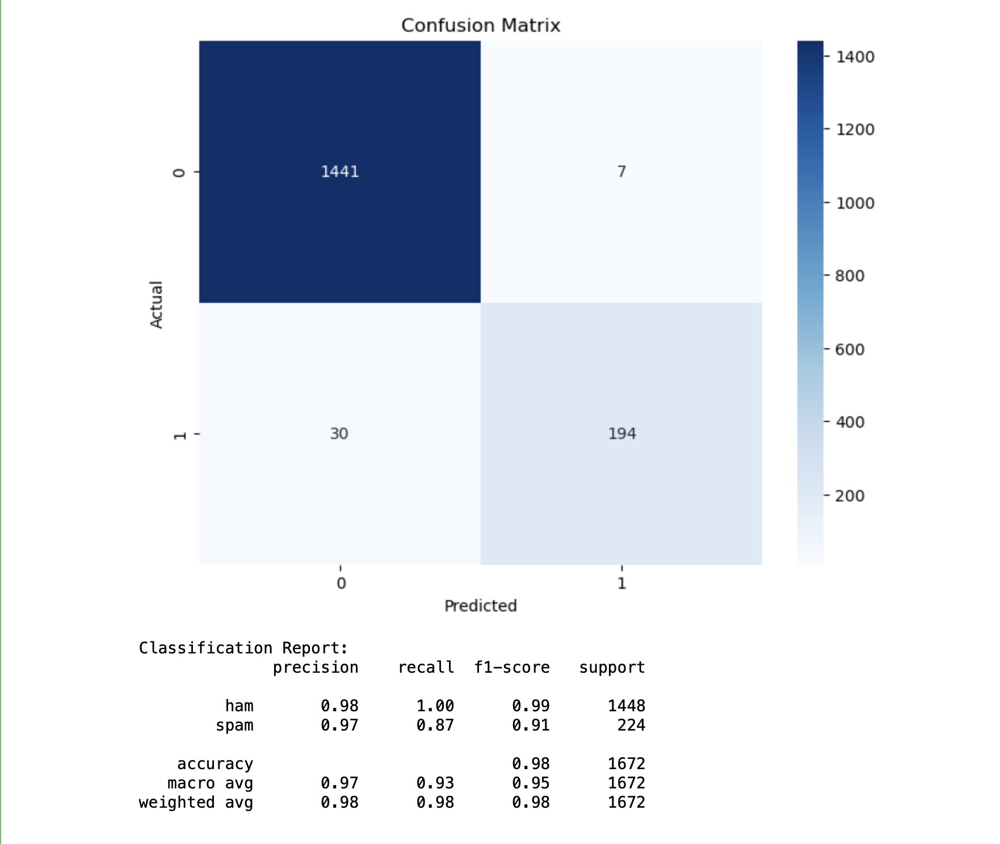
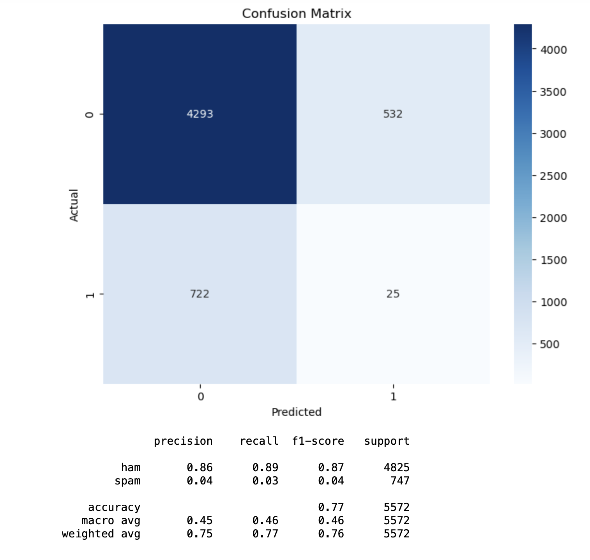

# Ham and Spam Classifier

This project is a text classification task that aims to distinguish between "ham" (legitimate) and "spam" messages. We compare two different machine learning models: Multinomial Naive Bayes and BERT (Bidirectional Encoder Representations from Transformers) to classify text messages.

## Project Overview

The primary goal of this project is to build a robust text classification model to identify "ham" and "spam" messages in a given dataset.

## Data

The dataset used in this project contains a collection of text messages, with each message labeled as "ham" or "spam."

## Models

Multinomial Naive Bayes

- Multinomial Naive Bayes is a classic and simple text classification algorithm.
- Achieved an accuracy of 98% and a high F1 score for the "ham" and "spam" classification task.

Fig: Multinomial Naive Bayes results

BERT (Bidirectional Encoder Representations from Transformers)

- BERT is a state-of-the-art deep learning model for natural language understanding.
- Achieved an accuracy of 77% and a lower F1 score compared to Multinomial Naive Bayes.

Fig: Bert model results
## Prerequisites

- Python (3.6+)
- Required libraries and dependencies (mentioned in the notebook)

##  Project Structure

The project is organized as follows:

- `data/`: Contains the dataset used for training and testing.
- `notebooks/`: Jupyter notebooks with code for data preprocessing, model training, and evaluation.
- `README.md`: This file.

## Usage

- To train and evaluate the models, follow the instructions provided in the Jupyter notebooks or Python scripts in the `notebooks/` and `src/` directories.

## Acknowledgments

- The dataset used in this project is from [kaggle](https://www.kaggle.com/datasets/abdallahwagih/spam-emails/data).

## Contact

- MD Fahim Afridi Ani
- fahimafridi043@gmail.com
- www.linkedin.com/in/fahim043

Feel free to reach out if you have any questions or feedback!
